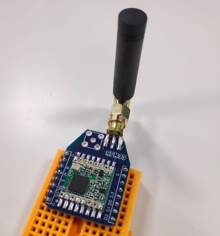
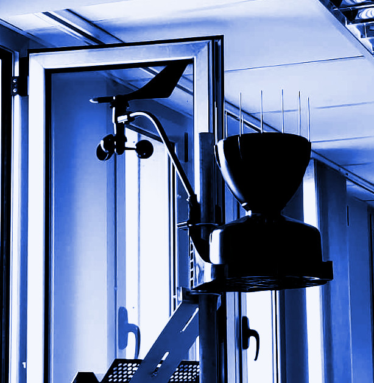

# Lora-Documentacion

## RFM95W 

Shield con comunicación LoRa

[Docu](https://github.com/MedialabU/LoRa-RFM95-Documentacion)

## VP2

Anemómetro y pluviómetro con LoRa

[Docu](https://github.com/MedialabU/LoRa-VP2-Documentacion)

